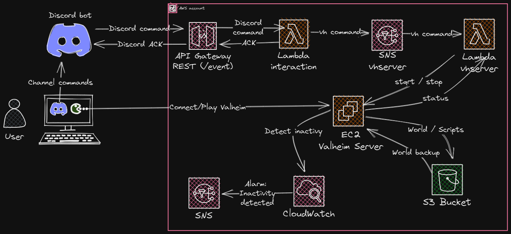

# valheim-aws

This project allows the configuration of an AWS infrastructure to support a Valheim dedidacted server controlled by a Discord bot.

**Features:**

- Automatic Valheim server configuration, update and backups.
- Use an already existing Valheim world.
- Automatically stop the server if nobody is connected after ~15 minutes (can save loads of money).
- Send a notification by mail when the server goes down.
- Discord bot `/vh` to control the Valheim server (`status`, `start`, `stop`).
- The Discord bot tells the IP/url to which the user must connect.

## Requirements

- AWS account including CLI configured on the machine environment.
- Terraform v1.3.6+
- Python 3.9+ (**only version 3.9+ is supported due to AWS Lambda function limitation**)

> **_Note:_** The project comes with a pre-configured vscode dev container including all the needed dependencies.

## Usage

1. Configure the AWS cli with the required credentials.
2. Create a Terraform backend S3 bucket to store your state files.
3. In the `infra/deploy/config` folder, create the following configuration files:

```text
valheim-aws               // (base project)
└── infra/deploy/config   // (custom config)
    ├── backend.tf        // (create me, example below)
    └── variables.tfvars  // (create me, example below)
```

Define the backend settings in `backend.tf` like the following example:

```yaml
# bucket to store the server data
bucket = "<your bucket name (see usage 1)>"
# store the terraform state in S3
key    = "valheim-server/prod/terraform.tfstate"
# define a region to store the infrastructure (the closest to the players the better)
region = "eu-west-3"
```

Define the infrastructure settings in `variables.tfvars` like the following example:

```yaml
# Deployment
stage = "dev"

# AWS settings
account_id       = "<AWS account id>"
aws_region       = "eu-west-3"         // Choose a region closest to your physical location
sns_email        = "cyril.pessan@gmail.com" // Alert go here e.g. server started, server stopped

# Valheim server
world_name          = "<name of your Valheim world>"
server_name         = "<name of your Valheim server>"
server_password     = "password"
ec2_keypair_name    = "<EC2 keypair name>"  // for debug purpose
initial_world_name  = "<name of your Valheim world to use as startup>"                // Optional, if set must be equal to 'world_name'
admins = {
  "bob"   = 76561197993928955 // Create an AWS user for remote management and make Valheim admin using SteamID
  "jane"  = 76561197994340319
  "sally" = ""                // Create an AWS user for remote management but don't make Valheim admin
}
instance_type       = "t3a.medium"   // "t3a.medium" seems to be the minimum config

# Discord secrets
discord_public_key     = "<Discord public key of the bot>"
discord_auth_token     = "<Discord auth token>"
discord_application_id = "<Discord bot application id>"
```

4. Execute the script `scripts/register-all-commands.sh` to register the Discord bot commands in the Discord environment. You must create an `.env` file in the `scripts` folder to define some environment variables **before** executing the script:

```env
DISCORD_APPLICATION_ID=
DISCORD_GUILD_ID=
DISCORD_BOT_TOKEN=
```

### How to use a pre existing world

1. In the `infra/deploy/config` folder, add the existing Valheim world files:

```txt
valheim-aws                 // (base project)
└── infra/deploy/config     // (custom config)
    └── world               // (custom world)
        ├── <myworld>.fwl   // (create me, example below)
        └── <myworld>.db    // (create me, example below)
```

2. In the `.tfvars` file, assign the world name to the var `initial_world_name`.

> **_WARNING:_** Due to the world beeing modified while playing the game, the configuration becomes non-idempotent. That means that each you re-apply the terraform configuration, the Valheim world will be overwritten with the one in the `world` folder. **Thus, it is highly recommanded to remove the `initial_world_name` variable definition from the `variables.tfvars` file after having successfully applied the configuration for the first time.**

### Monitoring

To view server monitoring metrics visit the `monitoring_url` output from
Terraform after deploying. Note that this URL will change every time the server
starts unless you're using your own domain in AWS. In this case I find it's
easier to just take note of the public IP address when you turn the server on.

### Timings

- It usually takes around 1 minute for Terraform to deploy all the components.
- Upon the first deployment the server will take 5-10 minutes to become ready.
- Subsequent starts will take 2-3 minutes before appearing on the server browser.

### Backups

The server logic around backups is as follows:

1. Check if world files exist locally and if so start the server using those.
2. If no files exist, try to fetch from backup store and use those.
3. If no backup files exist, create a new world and start the server.
4. Five minutes after the server has started perform a backup.
5. Perform backups every hour after boot.

### Restores

todo

## How it works

The AWS architecture and the terraform modules:



Note that there are two Lambda functions in interface with Discord:

- `interaction` is used to provide the ACK through the API Gateway in less than 3 seconds as requested by the Discord specification. It then forwards the initial Discord request to the second Lambda (`vhserver`) through an SNS topic for asynchronous execution.
- `vhserver` is called by SNS and processes the initial request received from the related topic. The Lambda then answers directly to the Discord client refering to the initial command token.

This architecture follows the good practice of decoupling the 2 Lambdas to limit their dependency, and so their respective execution time (cost optimization). This is possible since we do not need synchronous execution between the two.

## Infrastructure cost

The server is hosted in an EC2 spot instance. While the main advantage of this choice is obviously the cost saving, some drawback should be considered:

- A lack of availability can prevent the EC2 instance from being created.
- A new EC2 isntance is created each time the server is started. That involves a new public IP and DNS address each time. The workaround is that the updated address is provided to the users by the Discord bot. Another solution could be to register each time the instance to a custom domain. This last solution is not considered yet as it would make the infrastructure more expansive.

**TODO**: use Source: Infracost v0.8.5 `infracost breakdown --path . --show-skipped
--no-color`

--------------------------

## todo

- Add docs on performing restores
- Don't include empty keys in admin list
- Fix shellcheck and terraform docs pre commit
- Add tests e.g. cron, scripts exist, ports open, s3 access, etc
- Add support for spot instances
- Add Infracost v0.8.5 `infracost breakdown --path . --show-skipped
--no-color`
- Create a docker image to manage the full solution (dependencies, automate the full installation process).

## Credits

The `vhserver` module is based on the solution from [wahlfeld/valheim-on-aws](https://github.com/wahlfeld/valheim-on-aws/).
